# Mistral OCR Application 📄✨

## About 💡
This tool leverages Mistral OCR to scan PDF files, extract, and translate content. 
* ✅ Extracted text and images are saved into a structured directory system, categorized by both source and target languages.
* ✅ Scanned JSON and Markdown files are post-processed using a Mistral Large Language Model (LLM) to improve Markdown compliance.
* ✅ Automatically skips steps (scan, post-process, translate) to minimize token usage, with the ability to force a specific step for specific pages during prompt development and testing.
* ✅ Output directory structure is compatible with the upcoming project-viewer.

➡️ Note: A valid Mistral API key is required to run this tool.

### Workflow 🔄

```mermaid
graph TD
    A[📄 PDF File Input] -->|Scan with Mistral OCR| B[📂 raw.&lt;source_language_code&gt;];
    B -->|Post-process MD with Mistral LLM| C[📂 &lt;source_language_code&gt;];
    C -->|Translate with Mistral LLM| D[📂 raw.&lt;target_language_code&gt;];
    D -->|Copy| E[📂 &lt;target_language_code&gt;];
```



### Directory Structure 📂
The output directories are organized to provide a clear and accessible structure for the processed files:
- 📄`<file_name>.pdf`
+ 📂 `<file_name>`
  + 📂 `raw.<source_language_code>`
    - 📄 `<file_name>.raw.<source_language_code>.json`
    - 📄 `<file_name>.raw.<source_language_code>.md`
    - 📄 `<file_name>.raw.<source_language_code>_page_<page number>.md`
    - 📄 `img-<image_number>.jpeg>`
  + 📂 `<source_language_code>`
    - 📄 `<file_name>.<source_language_code>.json`
    - 📄 `<file_name>.<source_language_code>.md`
    - 📄 `<file_name>.<source_language_code>_page_<page number>.md`
    - 📄 `img-<image_number>.jpeg>`
  + 📂 `raw.<target_language_code>`
    - 📄 `<file_name>.raw.<target_language_code>.json`
    - 📄 `<file_name>.raw.<target_language_code>.md`
    - 📄 `<file_name>.raw.<target_language_code>_page_<page number>.md`
    - 📄 `img-<image_number>.jpeg>`
  + 📂 `<target_language_code>`
    - 📄 `<file_name>.<target_language_code>.json`
    - 📄 `<file_name>.<target_language_code>.md`
    - 📄 `<file_name>.<target_language_code>_page_<page number>.md`
    - 📄 `img-<image_number>.jpeg>`

## Getting Started 🚀

### Prerequisites ✅
1.  **`uv` for Python version management and dependency management**

    [`uv`](https://docs.astral.sh/uv/guides/install-python/) is a fast Python package installer and resolver, written in Rust.
    To check if `uv` is already installed, run:
    ```bash
    uv --version
    ```
    If `uv` is not found, you can install it using a [standalone installer](https://docs.astral.sh/uv/getting-started/installation/#standalone-installer) or through your [preferred package manager](https://docs.astral.sh/uv/getting-started/installation/#pypi). Make sure `uv --version` returns a version number before proceeding. For instance:
    ```
    uv --version
    uv 0.8.3 (7e78f54e7 2025-07-24)
    ```

2. **Mistral API Key** 🔑

    A valid API key from Mistral is required for OCR and LLM functionalities. 
    You can obtain one from the [Mistral AI website](https://mistral.ai/) and manage your key at [Your API keys](https://console.mistral.ai/api-keys).

### Installation 🛠️
1.  **Clone the repository**:
    ```bash
    git clone https://github.com/ytkaczyk/ai-ocr.git
    cd ai-ocr/apps/mistral
    ```

2.  **Install Dependencies:**
    * Install all required packages using `uv sync`:
        ```bash
        uv sync
        ```
        *(This installs all necessary libraries and their dependencies as described in the `uv.lock` file.)*

3.  **Configure your Mistral API Key**:
    * Copy the `.example.env` file to `.env`:
    ```bash
    cp .example.env .env
    ```
    
    * Edit the `.env` file with the Mistral API key generated at [Your API keys](https://console.mistral.ai/api-keys).
      The key is a 32-alphanumeric character string. 

## Usage 💡
To run the application, use the following command structure:

  ```bash
  uv run main.py --input <pdf_file> --source <language_code> --target <language_code> 
  ```


### Command Arguments:
*   `--input <pdf_file>`: **(Required)** Specifies the path to the PDF file you wish to process.
*   `--source <language_code>`: **(Required)** Comma-separated list of language codes for the source text in the PDF (e.g., `en` for English, `fr` for French, `en,fr` for documents containing both English and French).
*   `--target <language_code>`: **(Required)** The language code for the desired output translation (e.g., `es` for Spanish, `de` for German).
*   `--force_ocr`: **(Optional)** Forces the OCR process to run even if raw OCR files already exist. It does not force if the flag is omitted and forces if the flag is present. 
*   `--force_ocr_post_process`: **(Optional)** Forces the OCR post-processing step to run even if post-processed files already exist. It does not force if the flag is omitted and forces if the flag is present.
*   `--force-translate`: **(Optional)** Forces the translation step to run even if translated files already exist. It does not force if the flag is omitted and forces if the flag is present.
*   `--limit_to_pages <page_numbers>`: **(Optional)** A comma-separated list of page numbers to process (e.g., `1,3,5`).


### Example:
* To process a PDF named `document.pdf` from English to Spanish:
  ```bash
  uv run main.py --input document.pdf --source en --target es
  ```

* To scan a document (only if not already done) and only process pages 1 and 2, forcing post-processing regardless of whether it has been done before. This is helpful for prompt tuning. 

  ```bash
  uv run main.py --input <pdf_file> --source <language_code> --target <language_code> --force_ocr_post_process --limit_to_pages 1,2
  ```

## AI coding assistance with Cline 🤖

The tool was mainly coded by hand. 
[Cline AI for VSCode](https://cline.bot/) was used to add minor features (e.g., `limit_to_page` functionality). Cline AI is an open-source coding agent that can understand entire codebases, plan complex changes, and execute multi-step tasks.
